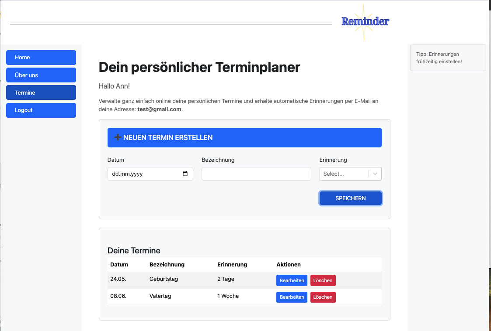

# Reminder Calendar

## Projektbeschreibung

**Reminder Calendar** ist eine Webanwendung zur effizienten Verwaltung persönlicher Termine und Erinnerungen. Sie kombiniert ein modernes Frontend auf Basis von React mit einem PHP-Backend, das unter Verwendung von Eloquent ORM auf eine MySQL-Datenbank zugreift.



🎯 Funktionen
- Benutzerregistrierung und Login
- Erstellen, Bearbeiten und Löschen von Terminen
- Ein Skript versendet tägliche Erinnerungsmails für anstehende Termine per Cronjob.
- Responsive Design für Desktop und mobile Geräte
- Eine Datenbank zur Verwaltung von Benutzern, Terminen und Sessions.
- Modelle für User, Appointments und User Tokens verwalten die Benutzerdaten, Termine und Authentifizierungstoken, einschließlich ihrer Beziehungen und Validierungen.
- Eine REST-API für eine nahtlose Kommunikation zwischen Frontend und Backend.
- Frontend-Validierungen zur Sicherstellung der Datenkonsistenz
- HttpOnly-Cookie zur Speicherung der Benutzersitzung.

## 🚀 Installation

### Technologie-Stack
- PHP OOP mit Eloquent ORM
- React
- REST API
- Cookie
- Bootstrap CSS
- XAMPP & MySQL

### Schritte
1.  Projektordner vorbereiten
- XAMPP installieren und starten.
- Lege einen neuen Ordner im htdocs-Verzeichnis von XAMPP an, z. B. reminder-calendar.
```bash
cd C:\xampp\htdocs
```

2. Repository klonen oder Dateien kopieren
```bash
git clone [<REPOSITORY-URL>](https://github.com/anntnt/reminder-calendar.git) reminder-calendar
```  

3. Backend (Ordner app/ mit PHP & Eloquent ORM) einrichten
- In das Verzeichnis app/ wechseln und Dependencies installieren:
```bash
cd reminder-calendar/app
composer install
```  
- Eloquent konfigurieren:

Bearbeite die Datei app/config/bootstrap.php:
```bash
$capsule->addConnection([
    'driver'    => 'mysql',
    'host'      => $_ENV['DB_HOST'],
    'database'  => $_ENV['DB_NAME'] ,
    'username'  => $_ENV['DB_USER'],
    'password'  => $_ENV['DB_PASS'] ,
    'charset'   => 'utf8mb4',
    'collation' => 'utf8mb4_unicode_ci',
    'prefix'    => '',
]);

...
# Configuration für CORS
$ALLOWED_ORIGINS = [
    'http://localhost:3000',
    'https://reminder-calendar.fly.dev' #Ersetze durch die richtige Domain“
];
```
4. MySQL-Datenbank mit phpMyAdmin
- Öffne http://localhost/phpmyadmin

- Erstelle eine neue Datenbank mit dem Namen reminder_calendar

- Führe ggf. das SQL-Skript database/schema.sql aus, um Tabellen zu erstellen

5. Umgebungsvariablen setzen
- Erstelle eine .env-Datei im Verzeichnis react-app/, ersetze durch die richtigen daten
```bash
DB_HOST=127.0.0.1
DB_NAME=reminder-calendar
DB_PORT=3306
DB_USER=xxxxx
DB_PASS=xxxxx

```
6. Frontend (react-app/) einrichten
- Wechsle in das Verzeichnis react-app/:
```bash
cd ../react-app
```
- Dependencies installieren
```bash
npm install
```
- Entwicklungsserver starten:
```bash
npm run dev
```
React läuft standardmäßig unter http://localhost:3000

7. Erinnerungs-Skript ausführen
Das Projekt enthält ein PHP-Skript zur automatischen Erinnerungsversendung per E-Mail:
```bash
php app/send_reminders.php
```
**Automatisierung (Cronjob)**
Um tägliche Erinnerungen automatisch zu versenden, kann man einen Cronjob einrichten

9. Testmails mit Mailhog anzeigen

Falls man Mailhog zur lokalen Mail-Entwicklung verwendet:

- Starte Mailhog (z. B. via Docker oder Terminal)

- Besuche im Browser: http://localhost:8025

- Dort werden alle Testmails angezeigt, die vom Skript gesendet wurden

Achte darauf, dass dein PHP-Mailer auf localhost:1025 sendet, wenn Mailhog läuft (z. B. über SMTP-Host-Konfiguration in deinem Code oder in .env).

```bash
#Test SMTP
MAIL_HOST=127.0.0.1
MAIL_SMTP_AUTH=false
MAIL_PORT=1025
MAIL_FROM_ADDRESS=no-reply@example.com
MAIL_FROM_NAME="Reminder System"
```

10. Zukünftige Erweiterungen
- Möglichkeit zum Ändern des Passworts
- Adresse hinzufügen und über Google Maps anzeigen
- Integration mit Google Kalender oder Outlook


