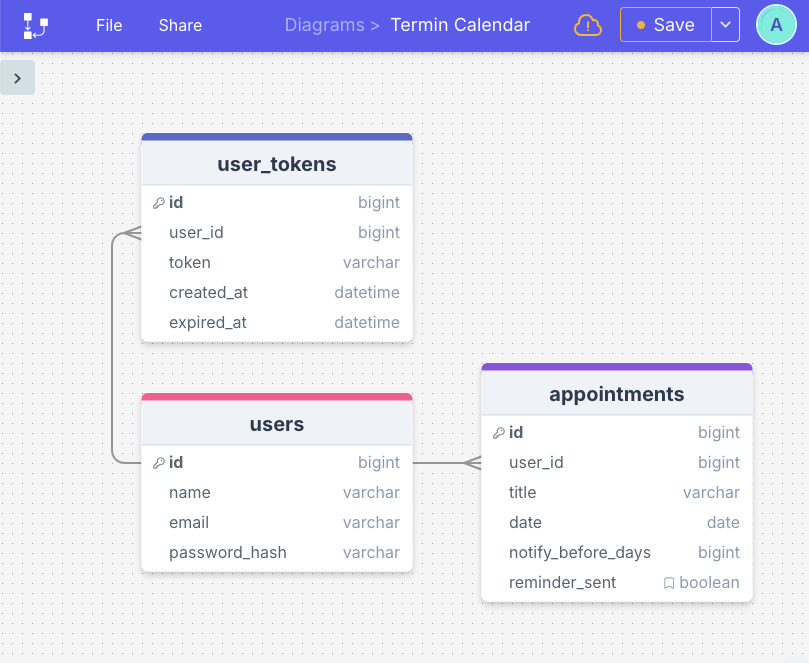
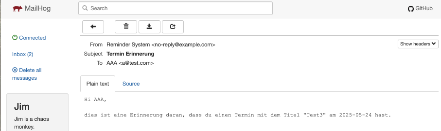

# Reminder Calendar

## Projektbeschreibung

**Reminder Calendar** ist eine laufende Webanwendung zur Verwaltung persönlicher Termine und Erinnerungen. Sie kombiniert ein Frontend auf Basis von React mit einem PHP-Backend, das unter Verwendung von Eloquent ORM auf eine MySQL-Datenbank zugreift.


🎯 Funktionen
- Benutzerregistrierung und Login
- Erstellen, Bearbeiten und Löschen von Terminen
- Ein Skript versendet tägliche Erinnerungsmails für anstehende Termine per Cronjob.
- Responsive Design für Desktop und mobile Geräte
- Eine Datenbank zur Verwaltung von Benutzern, Terminen und Sessions.
- Modelle für User, Appointments und User Tokens verwalten die Benutzerdaten, Termine und Authentifizierungstoken, einschließlich ihrer Beziehungen und Validierungen.
- Eine REST-API für eine nahtlose Kommunikation zwischen Frontend und Backend.
- Frontend-Validierungen zur Sicherstellung der Datenkonsistenz
- HttpOnly-Cookie zur Speicherung der Benutzersitzung.

## 🚀 Installation

### Technologie-Stack
- PHP OOP mit Eloquent ORM
- React
- REST API
- Cookie
- Bootstrap CSS
- XAMPP & MySQL

### Database diagram


### Anleitung: Projekt lokal installieren
#### 1.  Projektordner vorbereiten
- XAMPP installieren und starten.
- Lege einen neuen Ordner im htdocs-Verzeichnis von XAMPP an, z. B. reminder-calendar.
```bash
cd C:\xampp\htdocs
```

#### 2. Repository klonen oder Dateien kopieren
```bash
git clone https://github.com/anntnt/reminder-calendar.git reminder-calendar
```  

#### 3. Backend (Ordner app/ mit PHP & Eloquent ORM) einrichten
- In das Verzeichnis app/ wechseln und Dependencies installieren:
```bash
cd reminder-calendar/app
composer install
```

- Eloquent konfigurieren:

Bearbeite die Datei app/config/bootstrap.php:
```bash
$capsule->addConnection([
    'driver'    => 'mysql',
    'host'      => $_ENV['DB_HOST'],
    'database'  => $_ENV['DB_NAME'] ,
    'username'  => $_ENV['DB_USER'],
    'password'  => $_ENV['DB_PASS'] ,
    'charset'   => 'utf8mb4',
    'collation' => 'utf8mb4_unicode_ci',
    'prefix'    => '',
]);

...
# Configuration für CORS
$ALLOWED_ORIGINS = [
    'http://localhost:3000',
    'https://reminder-calendar.fly.dev' #Ersetze durch die richtige Domain“
];
```
#### 4. MySQL-Datenbank mit phpMyAdmin
- Öffne http://localhost/phpmyadmin

- Mit phpMyAdmin erstelle eine Datenbank namens reminder_calendar und einen Benutzer reminder_calendar in MySQL. Gewähre diesem Benutzer alle Rechte auf dieser Datenbank.

- Führe ggf. das SQL-Skript database/schema.sql aus, um Tabellen zu erstellen

#### 5. Umgebungsvariablen setzen
- Erstelle eine .env-Datei im Projekt Verzeichnis, ersetze durch die richtigen daten
```bash
DB_HOST=127.0.0.1
DB_NAME=reminder-calendar
DB_PORT=3306
DB_USER=reminder_calendar
DB_PASS=xxxxx

```
#### 6. Frontend (react-app/) einrichten
- Wechsle in das Verzeichnis react-app/:
```bash
cd ../react-app
```
- Dependencies installieren
```bash
npm install
```
- Entwicklungsserver starten:
```bash
npm start
```
React läuft standardmäßig unter http://localhost:3000

#### 7. Erinnerungs-Skript ausführen
Das Projekt enthält ein PHP-Skript zur automatischen Erinnerungsversendung per E-Mail:
```bash
php app/send_reminders.php
```
**Automatisierung (Cronjob)**
Um tägliche Erinnerungen automatisch zu versenden, kann man einen Cronjob einrichten

#### 8. Testmails 
In macOS mit MailHog anzeigen:

Falls man Mailhog zur lokalen Mail-Entwicklung verwendet:

- Starte Mailhog (z. B. via Docker oder Terminal)

- Besuche im Browser: http://localhost:8025

- Dort werden alle Testmails angezeigt, die vom Skript gesendet wurden

Achte darauf, dass dein PHP-Mailer auf localhost:1025 sendet, wenn Mailhog läuft (z. B. über SMTP-Host-Konfiguration in deinem Code oder in .env).

```bash
#Test SMTP
MAIL_HOST=127.0.0.1
MAIL_SMTP_AUTH=false
MAIL_PORT=1025
MAIL_FROM_ADDRESS=no-reply@example.com
MAIL_FROM_NAME="Reminder System"
```


Oder
in Windows mit PaperCut SMTP anzeigen:
- Papercut SMTP herunterladen

  Gehe zur [Papercut SMTP GitHub-Releases-Seite](https://github.com/ChangemakerStudios/Papercut-SMTP/releases).  
  Lade die neueste **Papercut.Windows.exe** (den Installer) herunter.

- Papercut SMTP installieren

  Führe die heruntergeladene `.exe`-Datei aus.  
  Folge den Installationsanweisungen (normalerweise einfach Weiter, Weiter, Fertig stellen).  
  Nach der Installation startet Papercut automatisch.

- Deine Anwendung konfigurieren, um E-Mails über Papercut zu senden

  **SMTP-Server:** `localhost`  
  **Port:** `25` (Standard)  
  **Keine Authentifizierung erforderlich**  
  **Kein SSL/TLS erforderlich**

- E-Mails aus deiner App senden

  Jede E-Mail, die an Papercut gesendet wird, wird lokal abgefangen und **nicht wirklich versendet**.

- Abgefangene E-Mails anzeigen

  Papercut zeigt eine einfache Benutzeroberfläche mit einer Liste empfangener E-Mails.  
  Klicke auf eine E-Mail, um deren Inhalt, Header, Anhänge usw. anzuzeigen.

- Papercut beenden (optional)

  Du kannst das Papercut-Fenster schließen oder die App beenden, wenn du mit dem Testen fertig bist.

## Zukünftige Erweiterungen
- Möglichkeit zum Ändern des Passworts
- Adresse hinzufügen und über Google Maps anzeigen
- Integration mit Google Kalender oder Outlook


